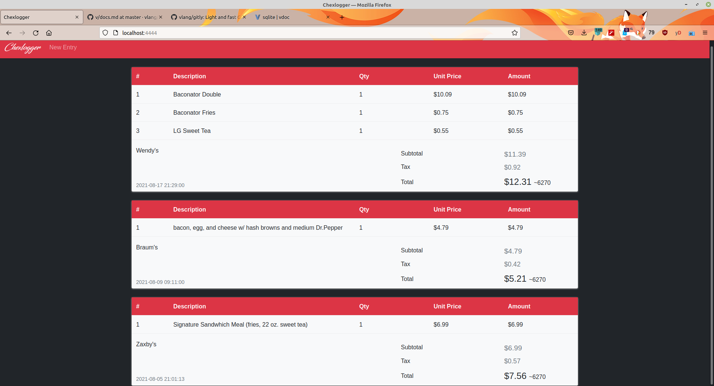

# Chexlogger
An application written in V to log and view info about past purchases. If you've got any questions, suggestions, or bugs to report, visit the [discord](https://discord.gg/sVq3zwsKAH).

## Features
- [x] View and create transactions
- [ ] Alternate themes
- [ ] Transaction analysis page
- [ ] Receipt templates, maybe? (like for when you order the same thing at a restaurant everyday)

## Usage
If you choose to download the binary, you'll also need to download the `chexlogger.db` file. It must be in the same directory as the binary. After running the binary you'll go to localhost:4444 in your browser to use Chexlogger. Note: I use Linux as a daily-driver, so I have no way to test the Windows and MacOS binaries. I apologize if they aren't working.

You can create an executable from source by executing `v .` in the terminal. Or you
can run from source by using `v run .`. If you're building from source, feel free to edit the values in `conf.v` for a more customized experience.

## Depends
No dependencies for the binaries. For building from source, you'll need [V](https://www.vlang.io/). You'll also need SQLite if you're building from source. Instructions for Windows can be found [here](https://modules.vlang.io/sqlite.html). For Debian-based Linux distros run `sudo apt install sqlite` in your terminal. SQLite is pre-installed on modern versions of MacOS.

### Donations
If you like this project feel free to donate (Pls, I'm broke \*tears\*).

BTC: 3J6sSQeQS1kTkUZ1XFeq2trAvSVmkCePHH 
ETH: 0x65A70Ff99396b69252e726992778Cf3607607255

